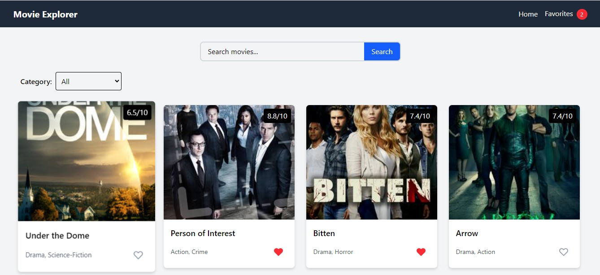

# Movie Explorer

A single-page application (SPA) built with React that allows users to explore movies from the TVMaze API.

## Features

- **Movie Browsing**: View a grid of movies fetched from TVMaze API
- **Movie Details**: Click on any movie to see detailed information
- **Search Functionality**: Search for movies by title
- **Category Filtering**: Filter movies by genre/category
- **Favorites System**: Add/remove movies to favorites with persistent storage
- **Responsive Design**: Works on mobile, tablet, and desktop devices

## Technologies Used

- **React**: Frontend library for building user interfaces
- **React Router**: For navigation between pages
- **Axios**: For API requests
- **localStorage**: For persisting favorites data
- **Vite**: Build tool and development server
- **Tailwind CSS**: For styling components

## Project Structure

```
/src
  /components
    Navbar.jsx
    MovieCard.jsx
    SearchBar.jsx
    CategoryFilter.jsx
  /pages
    Home.jsx
    MovieDetails.jsx
    Favorites.jsx
  /hooks
    useFetchMovies.js
    useFavorites.js
  /utils
    api.js
  App.jsx
  main.jsx

## Usage

- **Home Page**: Browse all movies, search, and filter by category
- **Movie Details**: Click on any movie to view its details
- **Favorites**: Click the heart icon to add/remove movies from favorites
- **Favorites Page**: Access your saved movies via the "Favorites" link in the navigation bar

## API

This project uses the [TVMaze API](https://api.tvmaze.com/shows) to fetch movie data.

## Screenshots


